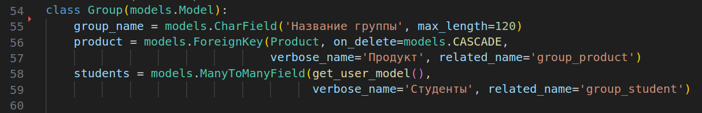
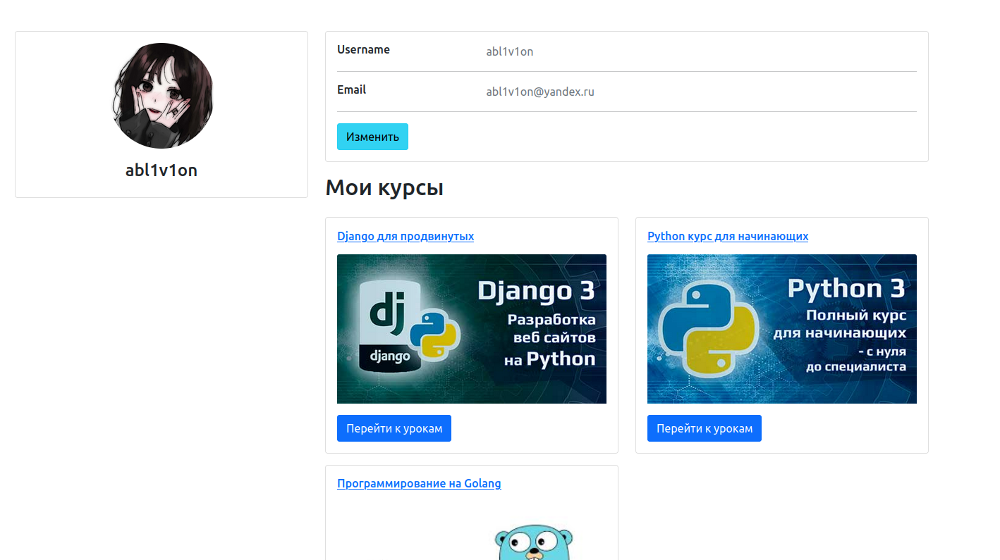

# Тестовое задание

Немного намудрил с объемом проекта, добавил много 'отсебятины', но как сказано в данной мне задаче:

Поэтому решил более масштабно описать свое умение работать с БД. Несмотря на это, с основными задачами считаю, что справился. Постараюсь кратко объяснить, что и как делал в конкретной задаче. К каждой функции предоставляется комментарий. За референс взял платформу Stepik. В тексте могут попасться грамитические ошибки, ибо печатаю со скоростью падения рубля.

### Построение архитектуры

##### Сущность продукта

Я написал следующую модель:

~~~python
# products/models.py
class Product(models.Model):
	product_name = models.CharField('Название', max_length=120)
	description = models.TextField('Описание')
	start_date = models.DateField('Дата начала')
	price = models.DecimalField('Цена', max_digits=10, decimal_places=2)
	author = models.ManyToManyField(get_user_model(), verbose_name='Авторы',
	related_name='product_author')
	product_cover = models.ImageField('Обложка', upload_to='product_covers/%Y')
	slug = models.SlugField('URL', max_length=120, unique=True, db_index=True)
	max_student_quantity = models.PositiveIntegerField(
	'Максимальное количество студентов в группе',
	default=5
	)
	is_published = models.BooleanField('Опубликован', default=False)
~~~

Решил для полноты картины добавить поля `description` - описание курса, `product_cover` - обложка курса, `slug`,  `is_published` - флаг, который по дефолту стоит как False и отвечает за ограничение доступа пользователей к курсу. Так-же создал связь **many-to-many** с таблицей пользователей, чтобы у продукта могло быть несколько создателей.

Для изменения значения поля `is_published` я решил использовать celery, написал таск, который будет работать в фоновом режиме и проверять, не сегодня ли дата начала курса (`start_date`):

Сначала мы получаем текущую дату, для этого используем datetime (поставил timezone ЕКБ чтобы мне было удобнее тестить), далее пробегаемся циклом по всем курсам, конвертируем значение поля `start_date` в объект `datetime` и сравниваем текущую дату с датой указанной в `start_date`. Если текущая дата равна или больше `start_date`, то мы изменяем значение `is_published` на True. 

Далее, в файле `celery.py` каталога `Stepik` ставим ранее созданный таск на повторение, в моем случае - это каждые две минуты, опять же, чтобы было удобнее тестить:

Теперь каждые две минуты будет запускаться таск и сравнивать дату начала курса с текущей датой. 

##### Ограничение доступа к продукту

За ограничение доступа пользователей к продукту отвечает раннее описанный `is_published`. Так-же во вьюхе, которая обрабатывает страницу информации о продукте есть проверка на то, авторизован пользователь или нет. Происходит это при нажатии на "Записаться на курс".

##### Сущность урока

~~~python
# products/models.py
class Lesson(models.Model):
	lesson_name = models.CharField('Название', max_length=120)
	video_content = models.FileField('Видео', upload_to='videos/%Y')
	product = models.ForeignKey(Product, verbose_name='Товар',
					on_delete=models.CASCADE, related_name='lessons')
~~~

Тут не стал ничего выдумывать и сделал всё по заданию. Поле `video_content` хранит ссылку на видео файл, расположенный в каталоге `media`. Поле `product` ссылается на модель `Product` и связывает эти таблицы.

Так-же добавлю, что сделал сигнал, который ловит момент создания нового урока и отправляет ученикам курса, в который был добавлен этот урок сообщения на почту. Для этого расширил базовую модель `User` и добавил туда кастомные поля:

Поле `profil_pic` - это ссылка на аватарку пользователя. Поле `profile_desc` - описание профиля. Поле `sub_to_newsletter` - будет использоваться как чек-бокс при регистрации пользователя. Если пользователь нажмет на него, то он сможет получать информацию о выходе новых уроков себе на почту. 

Создал celery таск, который будет рассылать сообщения о выходе нового курса его ученикам:

Для отправки писем на почту использовал почтовый сервер Яндекса. Логика работы таска описана в комментариях на фото выше.

Далее, в каталоге `products` создал файл `signals.py`, который будет срабатывать в момент добавления нового урока и вызывать раннее созданный таск:

##### Сущность группы

Подробнее о том, как я реализовал добавление учеников в группы будет в следующем разделе.

### Написание запросов и реализация логики распределения

##### Распределение пользователей по группам

Логика создания групп курса описана в файле `utils.py` каталога `products`.  Я создал функцию `add_user_in_group`, которая принимает объект продукта и пользователя. Первым делом идет проверка, существуют ли группы у данного продукта. Делаем это с помощью функции `group_count`, которая принимает объект группы и возвращает кол-во групп связанных с этим продуктом:

~~~python
# products/utils.py
def group_count(product):
	return Group.objects.filter(product_id=product.id).count()
~~~

Если количество групп 0, то с помощью функции `create_group`, которая так-же принимает объект группы, создаем первую группу:

~~~python
# products/utils.py
def create_group(product):
Group.objects.create(
	group_name=f'{product.product_name} - группа {group_count(product) + 1}',
	product_id=product.id
)
~~~

Далее получаем объект последней созданной группы (`group`) и кол-во студентов в этой группе (`quantity_students_in_group`). После этого делаем проверку, не превышает ли кол-во студентов группы максимально возможное значение, которое указывается в поле `max_student_quantity` модели `Product`. Если группа переполнена, то мы с помощью функции `create_group` создаем новую группу, создаем объект этой группы и добавляем туда ученика (`group.students.add(user)`). Если же группа ещё не переполнена, то просто добавляем ученика в группу.

Раннее созданная функция `add_user_in_group` вызывается в момент нажатия на кнопку "Записаться на курс", которая находиться на странице информации о продукте:

 

Внутри вьюхи `product_detail`, которая отвечает за обработку страниц информации о продукте мы 'ловим' момент нажатия на кнопку и вызываем функцию `add_user_in_group`:

 

Здесь нет проверки на то, записан ли уже пользователь на этот курс, так как даже если пользователь нажмет кнопку несколько раз (чего случиться вроде как не может, потому за счет передаваемого в шаблон параметра `is_sub`  мы контролируем состояние кнопки), то ничего не случиться, пользователь не добавиться в ту же группу ещё раз. Если `is_sub` равен True, но курс всё ещё не вышел, то на странице продукту пропадет кнопка и появится предупреждающая надпись:

Параметр `is_sub` хранит в себе значение либо True, либо False за счет функции `check_subscription`, которая проверяет записан ли пользователь на этот курс или нет:

~~~python
# products/utils.py
def check_subscription(product, user):
	if not product.group_product.last():
		return False

	elif user in product.group_product.last().students.all():
		return True

	return False
~~~

Если параметр `is_sub` True, значит пользователь уже записан на этот курс и ему будет отображаться другая кнопка. В ином случае, пользователь без проблем запишется на курс.

##### API списка продуктов доступных для покупки

Для реализации API проекта создал отдельное приложение, назвал его `api`. Создал файл `serializers.py`, который будет хранить в себе наши сериализаторы. Создал сериализатор `ProductSerializer`, который будет конвертировать наши данные с БД в JSON формат:

~~~python
# api/serializers.py
class ProductSerializer(serializers.ModelSerializer):
	lessons_quantity = serializers.SerializerMethodField()
	
	def get_lessons_quantity(slef, obj):
		return obj.lessons.count()
		
	class Meta:
		model = Product
		fields = '__all__'
~~~

Создал метод `get_lessons_quantity`, который будет возвращать кол-во уроков конкретного продукта. Так-же написал класс контроллер `ProductListAPIView`, который связал с маршрутом `product-list/`:

~~~python
# api/views.py
class ProductListAPIView(APIView):
	def get(self, request):
		products = get_all_products()
		serializer = ProductSerializer(products, many=True)
		return Response(serializer.data)
~~~

~~~python
# api/urls.py
urlpatterns = [
	path('product-list/', views.ProductListAPIView.as_view(), name='product-list'),
]
~~~

В итоговом формате это выглядит так:

##### API списка уроков по конкретному продукту

В `serializers.py` добавил новый сериализатор для модели `Lesson`:

~~~python
# api/serializers.py
class LessonSerializer(serializers.ModelSerializer):
	class Meta:
		model = Lesson
		fields = '__all__'
~~~

Написал класс контроллер `LessonsListAPIView`, который связал с маршрутом `lessons-list/<slug:product_url>/`:

Тут мы обрабатываем GET запрос. В параметры пути передается `product_url` - это слаг продукту, уроки которого хочет получить пользователь. Далее, мы получаем объект продукта по переданному слагу и делаем проверку по полю `is_published`, если продукт опубликован, то мы оборачиваем все уроки продукта в сериализатор и возвращаем пользователю. Если продукт ещё не опубликован, то возвращаем сообщение о том, что курс ещё не доступен.

### Дополнительные задания

##### Количество учеников занимающихся на курсе

Для реализации этого задания я использовал раннее созданный сериализатор `ProductSerializer` и добавил туда метод `get_students_quantity`, который возвращает кол-во учеников курса:

~~~python
# api/serializers.py
class ProductSerializer(serializers.ModelSerializer):
	lessons_quantity = serializers.SerializerMethodField()
	students_quantity = serializers.SerializerMethodField()

	def get_students_quantity(self, obj):
		res = 0
		
		for group in obj.group_product.all():
			res += group.students.count()
		
		return res

	def get_lessons_quantity(slef, obj):
		return obj.lessons.count()

	class Meta:
		model = Product
		fields = '__all__'
~~~

Первым делом в методе `get_students_quantity` создаем переменную `res` с нулевым значением, далее приходимся циклом по всем группам и прибавляем к `res` кол-во учеников этой группы.

##### Процент заполненности групп

Добавляем в `ProductSerializr` метод `get_group_occupancy_percentage`, который возвращает процент заполненности групп или 0, если курс не имеет групп:

~~~python
# api/serializers.py
class ProductSerializer(serializers.ModelSerializer):
	lessons_quantity = serializers.SerializerMethodField()
	students_quantity = serializers.SerializerMethodField()
	group_occupancy_percentage = serializers.SerializerMethodField()

	def get_group_occupancy_percentage(self, obj):
		group_fullness = []
  
	for i in obj.group_product.all():
		group_fullness.append(i.students.count() / obj.max_student_quantity * 100)
	return sum(group_fullness) / len(group_fullness) if len(group_fullness) > 0 else 0

	def get_students_quantity(self, obj):
		res = 0
		
		for group in obj.group_product.all():
			res += group.students.count()
		
		return res

	def get_lessons_quantity(slef, obj):
		return obj.lessons.count()

	class Meta:
		model = Product
		fields = '__all__'
~~~

Создаем список `group_fullness`, пробегаемся циклом по все группам продукта и добавляем в список кол-во учеников этой группы деленное на максимальное кол-во учеников умноженное на 100. Далее возвращаем сумма всех элементов списка `group_fullness` деленную на размер списка `group_fullness`.

##### Процент приобретения продукта

Добавляем в `ProductSerializer` метод `get_product_purchase_percentage`, который вернет процент приобретения продукта:

~~~python
# api/serializers.py
class ProductSerializer(serializers.ModelSerializer):
	lessons_quantity = serializers.SerializerMethodField()
	students_quantity = serializers.SerializerMethodField()
	group_occupancy_percentage = serializers.SerializerMethodField()
	product_purchase_percentage = serializers.SerializerMethodField()

	def get_product_purchase_percentage(self, obj):
		students_quantity = get_user_model().objects.count()
		return self.get_students_quantity(obj) / students_quantity * 100

	def get_group_occupancy_percentage(self, obj):
		group_fullness = []
  
	for i in obj.group_product.all():
		group_fullness.append(i.students.count() / obj.max_student_quantity * 100)
	return sum(group_fullness) / len(group_fullness) if len(group_fullness) > 0 else 0

	def get_students_quantity(self, obj):
		res = 0
		
		for group in obj.group_product.all():
			res += group.students.count()
		
		return res

	def get_lessons_quantity(slef, obj):
		return obj.lessons.count()

	class Meta:
		model = Product
		fields = '__all__'
~~~

В переменную `students_quantity` записываем кол-во всех пользователей платформы, далее делим кол-во учеников конкретного курса на общее кол-во пользователей и получаем процент приобретения продукта.

Работу всех выше описанных методов можно увидеть по маршруту `api/product-list/`

### От себя

Решил привести проект в более работоспособный вид, поэтому от себя добавил некоторые фичи, такие как:

- Авторизация

	

	~~~python
	# users/views.py
	class LoginUserView(LoginView):
		form_class = LoginUserForm
		template_name = 'users/login.html'
		
		def get_context_data(self, **kwargs):
			context = super().get_context_data(**kwargs)
			context['title'] = 'Авторизация'
			return context

		def get_success_url(self):
			return reverse_lazy('home')
	~~~

- Регистрация

	

	~~~python
	# users/views.py
	class RegisterUserView(CreateView):
		form_class = RegisterUserForm
		template_name = 'users/signup.html'

		def get_context_data(self, **kwargs):
			context = super().get_context_data(**kwargs)
			context['title'] = 'Регистрация'
			return context

		def get_success_url(self):
			return reverse_lazy('user:login')
	~~~

- Профиль пользователя

	

	~~~python
	# users/views.py
	class UserProfile(DetailView):
		model = get_user_model()
		template_name = 'users/profile.html'
		context_object_name = 'user'

  

		def get_context_data(self, **kwargs):
			context = super().get_context_data(**kwargs)
			context['title'] = f'Профиль пользователя {self.object.username}'
			return context
	~~~

- Обновление данных профиля

	

	~~~python
	# users/views.py

	class UpdateProfile(UpdateView):
		model = get_user_model()
		template_name = 'users/update-profile.html'
		form_class = UpdateProfileForm

		def get_context_data(self, **kwargs):
			context = super().get_context_data(**kwargs)
			context['title'] = f'Редактирование профиля {self.object.username}'
			return context

		def get_success_url(self):
			return reverse_lazy('user:profile', kwargs={'pk': self.object.pk})

		def get(self, request, *args, **kwargs):
			"""
			Делаем проверку, чтобы пользователи
			не могли обратиться к чужому профилю через url
			"""
			if request.user.pk == kwargs['pk']:
				return super().get(request, *args, **kwargs)
			return redirect('home')
	~~~

- Страница со списком всех курсов и их сортировкой

	 

	~~~python
	# products/views.py
	def product_list(request):
		# Получаем все курсы и сортируем в обратном порядке по id
		products = get_all_products().order_by('-id')
		# Получаем параметр сортировки
		sort_by = request.GET.get('sort_by')

		# Проверяем, есть ли параметр сортировки. Если есть, то сортируем по указанному значению
		if sort_by:
			if sort_by == 'price':
				products = products.order_by('price')
			elif sort_by == '-price':
				products = products.order_by('-price')
			elif sort_by == 'start_date':
				products = products.order_by('start_date')

		context = {
			'products': products,
			'title': 'Список курсов',
			'sort_by': sort_by
		}

		return render(request, 'products/product-list.html', context)
	~~~

- Просмотр уроков курса

	Когда пользователь нажимает на кнопку "Перейти к урокам" (которая появляется на странице продукта и профиля, но только в том случае, если `is_published` продукта True), он переходит на страницу со списком всех уроков этого курса:

	 

	За обработку этой странице отвечает контроллер `lesson` в файле `views.py` приложения `products`:

	~~~python
	# products/views.py
	def lesson(request, product_url):
		product = get_object_or_404(Product, slug=product_url)
		
		if not product.is_published:
			return redirect('product:product_detail', product_url=product_url)

		current_lesson = request.GET.get('lesson') # Получаем текущий урок
		product_lessons = product.lessons.all() # Получаем все уроки конкретного курса
		lessons_quantity = product_lessons.count() # Кол-во уроков
		
		if current_lesson:

			if int(current_lesson) > lessons_quantity:
				return redirect('product:product_detail', product_url=product_url)
			product_lessons = product_lessons[int(current_lesson) - 1]

		context = {
			'title': product.product_name,
			'lessons': product_lessons,
			'current_lesson': current_lesson,
			'lessons_quantity': lessons_quantity
		}

		return render(request, 'products/lesson.html', context)
	~~~

	Здесь мы первым делом получаем объект `product` по слагу, далее проверяем параметр `is_published` (выключение кнопки на странице курса не дает гарантии, что кто-нибудь не захочет перейти к урокам через url). Если он равен False, перекидываем на страницу информации о курсе, а иначе даем пользователю смотреть уроки.  Далее мы записываем в переменную `current_lesson` текущий урок, который передается через URL. Затем получаем все уроки этого продукта и количество этих уроков. После происходит проверка, передан ли в пути параметр `lesson`.  Далее ещё одна проверка, если параметр current_lesson больше количества уроков, то перекидываем на страницу информации о курсе. Иначе переопределяем переменную `product_lessons` поместив в неё текущую серию:

	

	Кнопки "Следующий урок" и "Предыдущий урок", очевидно, прибавляют к параметру пути `lesson` +1 или -1. Если открыт первый урок, кнопка "Предыдущий урок",  пропадет, если открыт последний урок, то пропадет "Следующий урок".

### Docker

Обернул весь проект (с celery, redis и flower) в Docker, все подтягивается само, просто нужно поднять файл `docker-compose.yml`:

~~~terminal
sudo docker-compose up
~~~

Перейти на `http://0.0.0.0:1337/`, и на `http://localhost:5555`, если нужно отслеживать работу celery тасков.

